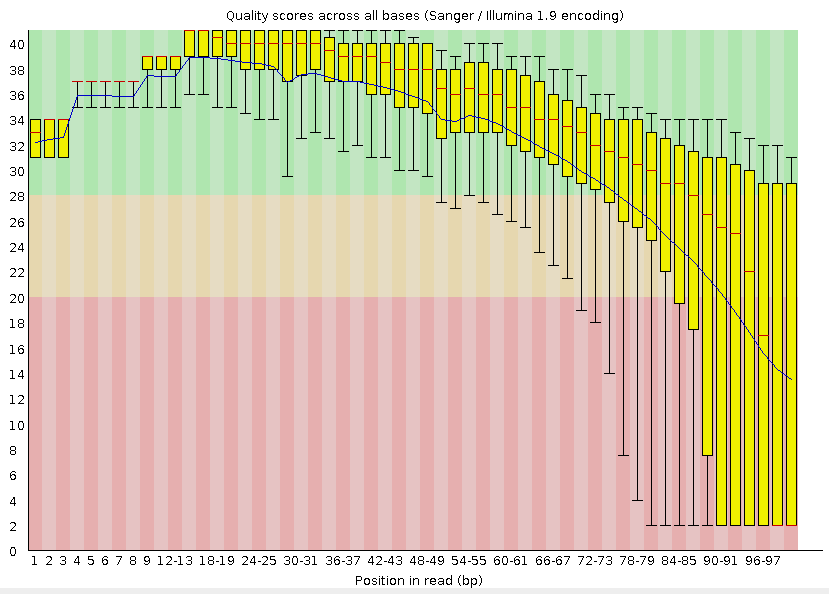
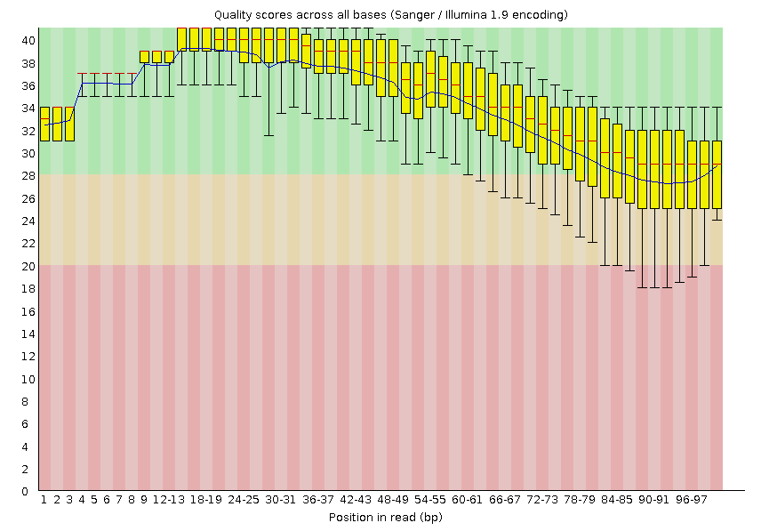

**Whole Exome Sequencing Data analysis tutorial**

**Step 1 : Data retrieval**
Database - Introduction
The Sequence Read Archive (SRA) stores raw sequence data from "next-generation" sequencing technologies including Illumina, 454, IonTorrent, Complete Genomics, PacBio and
OxfordNanopores. In addition to raw sequence data, SRA now stores alignment information in the form of read placements on a reference sequence. The SRA is NIH's primary archive of highthroughput sequencing data and is part of the International Nucleotide Sequence Database
Collaboration (INSDC) that includes at the NCBI Sequence Read Archive (SRA), the European Bioinformatics Institute (EBI), and the DNA Database of Japan (DDBJ). Data submitted to any of the three organizations are shared among them.

Resources
SRA
https://www.ncbi.nlm.nih.gov/sra

SRA_Toolkit
https://www.ncbi.nlm.nih.gov/sra/docs/toolkitsoft/

open terminal
1. create and change working directory
  
  $mkdir WES 
(create a directory named “WES”)
  
  $cd WES 
(change working directory to “WES”)
  
  $mkdir fastq 
(create a directory named “fastq”)

2. To download fastq files from SRA
  
  $fastq-dump SRR5858211 –split-files -o fastq
  
(this command will download fastq files with the id
SRR5858211 from SRA, the argument –split-files will separate the reads into SRR5858211_1 and
SRR5858211_2)

**Step 2: Quality check and Read Preprocessing**

Resources
FastQC
http://www.bioinformatics.babraham.ac.uk/projects/fastqc/
Fastp
https://github.com/OpenGene/fastp

Introduction
All the methods in this tutorial are better applicable to Illumina data sets only. Although Illumina
high throughput sequencing provides highly accurate sequence data, several sequence artifacts,
including base-calling errors and small insertions/deletions, poor quality reads and a
primer/adapter contamination, are quite common in the high throughput sequencing data, including
substitution errors. The error rates can vary from 0.5-2.0% with errors mainly rising in frequency at
the 3’ ends of reads. One way to investigate sequence data quality is to visualize the quality scores and other metrics in
a compact manner to get an idea about the quality of a read data set. Read data sets can be
improved by post processing in different ways like trimming off low-quality bases, cleaning up any
sequencing adapters, and removing PCR duplicates. We can also look at other statistics such as,
sequence length distribution, base composition, sequence complexity, presence of ambiguous
bases etc. to assess the overall quality of the data set.
Highly redundant coverage (>15X) of the genome can be used to correct sequencing errors in the
reads before assembly and errors. Various k-mer based error correction methods exist but are
beyond the scope of this tutorial.

1. create directories for fastqc output
  $mkdir fastqc_output
  
2. to check the quality of the reads
  $fastqc -t 30 reads/SRR5858211_1.fastq -o fastqc_output
  $fastqc -t 30 reads/SRR5858211_2.fastq -o fastqc_output
  
(after fastqc the 1st argument is -t 30 which specifies the number of threads to use for preocessing.
2nd argument is the fastq file to be checked for quality. 3rd argument is -o the location for fastqc
reports)
  
3. To view the fastqc reports use any browser
  $firefox fastqc_output/SRR5858211_1_fastq.html

The report file will have a Basic Statistics table and various graphs
and tables for different quality statistics. E.g.:

**Table 1:** FastQC Basic Statistics table

================= =======================
**File name**     **input.fastq**
File type         Conventional base calls
Encoding          Sanger / Illumina 1.9
Total Sequence    40000
Filtered Sequence 0
Sequence length   100
%GC               48
================= =======================

**Figure 1:** Per base sequence quality plot for example .fastq

  
A Phred quality score (or Q-score) expresses an error probability. In particular, it serves as a
convenient and compact way to communicate very small error probabilities. The probability that
base A is wrong (P ( A)) is expressed by a quality score, Q(A), according to the relationship: ∼Q(A) = −10log10(P ( A)) ∼
fastp is a powerful and efficient FASTQ preprocessor designed for high-throughput sequencing
data. It combines quality control, adapter trimming, and filtering into a single, fast, and user-friendly
tool.
  
1. create directory for fastp output
  
  $mkdir trimmed_reads
  
2. use fastp
  
  $fastp -i reads/SRR5858212_1.fastq -I reads/SRR5858212_2.fastq -o trimmed_reads_fastq/SRR5858212_1_trimmed.fastq.gz -O trimmed_reads_fastq/SRR5858212_2_trimmed.fastq.gz
  
(the arguments -i and -I are for read1 and read2 respectively
the arguments -o and -O are for outputs of read1 and read2 respectively)

3. quality check using fastqc on trimmed reads
  
  $mkdir fastp_fastqc_output 
( make directory for fastqc output)
  
  $fastqc -t 30 trimmed_reads_fastq/SRR5858212_1_trimmed.fastq.gz -o fastp_fastqc_output
  
  $fastqc -t 30 trimmed_reads_fastq/SRR5858212_2_trimmed.fastq.gz -o fastp_fastqc_output
  
to view the report
  
  $firefox fastp_fastqc_output/SRR5858211_1_trimmed_fastqc.html
  
The output should be like:
  
**Table 2:** FastQC Basic Statistics table

================= =========================
**File name**     **output_trimmed_fastqc**
File type         Conventional base calls
Encoding          Sanger / Illumina 1.9
Total Sequence    38976
Filtered Sequence 0
Sequence length   50-100
%GC               48
================= =========================

**Figure 2:** Per base sequence quality plot for the quality-trimmed
reads

**Step 3 : READ Alignment and preprocessing**

Resources

BWA
http://bio-bwa.sourceforge.net/

Samtools
http://samtools.sourceforge.net/
  
Introduction
The goal of this hands-on session is to perform an unspliced alignment for a small subset of raw
reads. We will align raw sequencing data (after preprocessing) to the human genome using BWA
and then we will manipulate the SAM output in order to visualize the alignment on the IGV browser.

Make directory for reference genome
  
  $mkdir reference

Download the reference genome, here we have used GRCh38.
https://ftp.ncbi.nlm.nih.gov/genomes/all/GCF/000/001/405/GCF_000001405.40_GRCh38.p14/GCF_000001405.40_GRCh38.p14_genomic.fna.gz

Index the reference genome

Before starting mapping, first we first need to index the reference genome. Indexing means
arranging the genome into easily searchable chunks.

  $bwa index reference/hg38.fa
(bwa index will output some files with a set of extensions (.amb, .ann, .bwt, .pac, .sa)

Alignment using BWA
make directory for alignment files
  $mkdir BWA_alignment
  $bwa mem -t 30 reference/hg38.fa trimmed_reads/SRR5858212_1_trimmed.fastq.gz trimmed_reads/SRR5858212_2_trimmed.fastq.gz > BWA_alignment/SRR5858212_alignment.sam

(we are using the bwa mem algorithm to align the reads. -t 30 specifies number of threads to be
used. Next argument is fastq file of read1 then read2 and final argument is for output file in sam
format)

Convert SAM to BAM

SAM stands for Sequence alignment mapping and BAM is its binary equivalent. This reduces
storage requirements in downstream analysis.

-Make directory for output
  
  $mkdir BWA_alignment_conversion

SAM to BAM
  
  $samtools view -@ 30 -bS BWA_alignment/SRR5858212_alignment.sam -o BWA_alignment_conversion/SRR5858212_alignment.bam

(-@ 30 for number of threads used, -bS specifies input file is in SAM format and output file should
be in BAM format. -o specifies the output BAM file)

Sort BAM files

When you map and align the reads to the reference, the resulting read alignments are in random
order with respect to their position in the reference genome. In other words, the .bam file is in the
order that the sequences occurred in the input .fastq file. So the BAM files must be sorted.

-BWA_alignment_sort

Make directory for output
  
  $mkdir BWA_alignment_sort

  $samtools sort -@ 30 BWA_alignment_conversion/SRR5858212_alignment.bam -o BWA_alignment_sort/SRR5858212_alignment_sort.bam

(sort function, 1st argument is the bam file then -o specifies the output file)

**Step 4: Remove PCR duplicates and add read group**
  
Resources

https://broadinstitute.github.io/picard/

Accurate variant calling requires the removal of PCR duplicates to avoid false positives and ensure
reliable identification of true genetic variations. Removing PCR duplicates improves the overall
quality of the sequencing data by reducing noise and increasing the accuracy of downstream
analyses.

-Make directory for output
 
  $mkdir PCR_duplicates_removed

  $java -Xmx100g -jar /home/bioinformatics/Desktop/Workshop/Tools/picard-tools-1.141/picard.jar MarkDuplicates INPUT=BWA_alignment_sort/SRR5858212_alignment_sort.bam OUTPUT=PCR_duplicates_removed/SRR5858212_alignment_PCR.bam REMOVE_DUPLICATES=true METRICS_FILE=SRR5858212_alignment_PR.Metrics VALIDATION_STRINGENCY=SILENT

(-Xmx100g allocates 100GB of memory so that there are enough memory for processing large
BAM files. -jar ../picard.jar path to the picard jar file. MarkDuplicates is the tool name, INPUT is the
sorted bam file. Output is user defined, also a bam file. REMOVE_DUPLICATESis set to true,
which will remove the duplicates from output file. METRIC_FILE will have information on duplicates
identified and removed. VALDIATION_STRINGENCY is set to silent to suppress warnings and
errors. Useful for large datasets)

ADD read group

Read groups provide metadata that helps organize and track large datasets, especially when
dealing with multiple samples, libraries, and sequencing runs.

  $java -Xmx100g -jar /home/bioinformatics/Desktop/Workshop/Tools/picard-tools-1.141/picard.jar AddOrReplaceReadGroups INPUT=PCR_duplicates_removed/SRR5858212_alignment_PCR.bam OUTPUT=Add_read_group/SRR5858212_alignment_RG.bam SORT_ORDER=coordinate RGID=SRR5858212 RGLB=SRR585812 RGPL=illumina RGPU=SRR5858212 RGSM=SRR5858212 CREATE_INDEX=true VALIDATION_STRINGENCY=SILENT

(AddOrReplaceReadGroups is the tool name, INPUT is the PCR duplicates removed bam file.
Output is also a bam file. SORT_ORDER set to coordinate. RGID, RGLB, RGPL, RGPU and
RGSM are the readgroup ID, Library, Platform and sample respectively. CREATE_INDEX is set to
true, which will create index file for the output bam file. VALIDATION_STRINGENCY is set to
SILENT to suppress warnings.)

**Step 5: Variant calling and Annotation**

Resource

https://github.com/broadinstitute/gatk/releases

Once you have aligned file against the human reference genome, you detected nucleotidie level
changes in the raw reads by comparing the reference genome using variant caller tools. There are
several best performing tools exist, such as DeepVariant, GATK, samtools and the Strelka etc.
GATK is a fast and accurate variant caller optimized for germline and somatic variants detection. In
this tutorial, we used a germline method to detect all variants from the retinoblastoma samples.

-Make directory for output
    
    $mkdir variant_calling

GATK HaplotypeCaller

  $/home/bioinformatics/Downloads/gatk-4.2.0.0/gatk HaplotypeCaller --java-options "-Xmx100g" -R ../../reference/hg38.fa -I Add_read_group/SRR5858212_alignment_RG.bam -O variant_calling/SRR5858212_GATK.vcf.gz 

(HaplotypeCaller is the tool used to call variants, -Xmx100g specifies 100GB of memory allocation,
-R for the reference genome file in fasta format. -I input BAM file. -O output VCF file).

Variant filtering based on desired genomic regions
    
By filtering the VCF file based on a BED file, you can focus on specific regions of the genome,
such as coding regions, exons, or regions of interest for a particular study. Here we use the tool
tabix

    $tabix -h -R ../../Covered_region.bed variant_calling/SRR5858212_GATK.vcf.gz > variant_calling/SRR5858212_GATK_Covered.vcf

(tabix is the tool, -h specifies to use the index to query the VCF file, -R specifies the BED file
containing the genomic region of interest. Next argument is the input VCF file containing variant
calls then “>” followed by the output vcf file.
 
Variant annotation

ANNOVAR is a rapid, efficient tool to annotate the functional consequences of genetic variation
from high-throughput sequencing data.

-Make directory for output files
  
 $mkdir variant_annotation

variant annotation

  $perl /home/bioinformatics/Documents/Tools/Annovar_37/table_annovar.pl variant_calling/SRR5858212_GATK_Covered.vcf /home/bioinformatics/Music/eyeVarP/Refence/humandb/ -buildver hg38 -out variant_annotation/SRR5858212_annovar -otherinfo -remove -protocol refGene,esp6500siv2_all,1000g2015aug_all,cosmic70,esp6500siv2_all,exac03,gnomad30_genom e,nci60,clinvar_20210123,avsnp150,ljb26_all,dbnsfp41a,dbscsnv11,intervar_20180118,mcap,revel,regsnpintron -operation g,f,f,f,f,f,f,f,f,f,f,f,f,f,f,f,f -nastring . -vcfinput

(table_annovar.pl is a perl script and should be executed with a perl interpreter. Next argument is
the input vcf file. Then location to humandb directory which contains all the preprocessed
databases. Then the reference genome build version, -out for the output prefix for annotated vcf
file. -otherinfo for additional information. -remove to remove temporary file. -protocol defines the set
of databases and annotations to use. -operation which operation to use for each protocol. G means
gene based. G means filter based. -nastring . Will fill fields with no annotation with a “.” -vcfinput
specifies that the input is in vcf file format).

**Step 6: VarP**

VarP is a variant prioritization model that gives a score to each variant based on their
pathogenicity, Allele frequency and other user defined parameters.

Make output directory
  
  $mkdir VarP

replace all the “=.” to “-999”.
  
  $sed 's/=.;/=-999;/g' variant_annotation/SRR5858212_annovar.hg38_multianno.vcf > variant_annotation/SRR5858212_VarP.vcf
(sed executes the stream editor, s for substitution, / is the delimiter. In this command it searches for
the patter “=.;” and changes them all to “-999;” . g is for global replacement. Then input and output
file names)

VarP input

  $printf 'variant_annotation/SRR5858212_VarP.vcf\tSRR5858212' > variant_annotation/SRR5858212.txt
this text file will be the input file for VarP it contains the path to the vcf file after the substitution
mentioned in the previous step separated by a tab and the name of the sample.

VarP

  $python3 /home/bioinformatics/Music/eyeVarP/Docker/VarP/VarP.py priority varp/SRR5858212_varp variant_annotation/SRR5858212.txt /home/bioinformatics/Music/eyeVarP/Docker/VarP default_0.001_variants_parameters_PPF.txt
(VarP is a python executed file. priority is the name of the function. Next argument is the prefix of
the output file. then the input txt file. then the parameters file.)

Combine VarP with heuristic method

  $Rscript /home/bioinformatics/Music/eyeVarP/Docker/Rscript/code/Filtering.r variant_annotation/SRR5858212_annovar.hg38_multianno.txt varp/SRR5858212_varp.txt varp/SRR5858212
The filtering program is an Rscript. It takes two inputs. one is the variant annotation file from
annovar another one is the prioritized file from VarP. It merges information from both the files and
produces a new dataset with combined annotations and scores.

  $grep -Ew 'Gene.refGene|splicing|stopgain|nonsynonymous SNV|frameshift deletion|frameshift insertion|stoploss|startloss' varp/SRR5858212.csv > varp/SRR5858212_VarP_extracted.csv
this command will extract lines with the mentioned keywords after the -Ew flag from the input csv
file and writes into the output csv file.

**Step 7: Exomiser and eyeVarP**

Resources
https://exomiser.readthedocs.io/en/latest/

eyeVarP https://doi.org/10.1016/j.gim.2023.100862

Exomiser is a powerful bioinformatics tool designed to prioritize disease-causing genetic variants
identified through whole-exome or whole-genome sequencing. Exomiser incorporates patient
phenotypes (described using HPO terms) into the variant prioritization process.
Exomiser needs a input yml file with the path to the input vcf file and HPO ID of the phenotypes we
want to prioritize the variants based on.

  $java -jar /home/bioinformatics/Downloads/exomiser/Exomiser/exomiser/exomiser-cli12.1.0/exomiser-cli-12.1.0.jar --analysis eyeVarP/test-analysis-exome.yml – spring.config.location=/home/bioinformatics/Downloads/exomiser/Exomiser/exomiser/exomiser-cli12.1.0/application.properties

(Exomiser is a java executable jar file. --analysis specifies the analysis configuration yml file.
--spring.config.location specifies the application.properties file).

eyeVarP model

eyeVarP is a A computational framework for the identification of pathogenic variants specific to eye
disease.
  $Rscript /home/bioinformatics/Music/eyeVarP/Docker/Rscript/code/eyeVarP.r eyeVarP/SRR5858212_GATK_Covered.variants.tsv varp/SRR5858212_VarP_extracted.csv /home/bioinformatics/Music/eyeVarP/Refence/Gene_ranking.csv eyeVarP/SRR5858212_eyeVarP_final 
(eyeVarP is programmed in R. It takes three input files. A tsv file generated by exomiser, a VarP
output file and a gene ranking file. the last argument is the prefix of the output file. )
